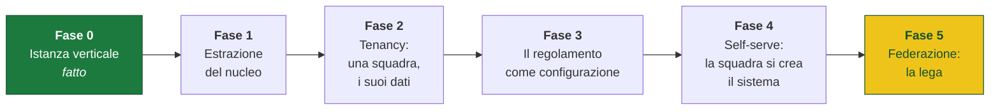

<div align="center">

# 🦁 Green Lions

**Il sistema operativo di una squadra di calcio amatoriale.**

Divise, rosa, calendario, disponibilità, distinta ufficiale, formazione, classifica.
Tutto quello che oggi vive sparso in un gruppo WhatsApp, in un posto solo —
senza app da installare, senza account da creare, senza password da ricordare.

`in produzione` · `usato dalla squadra ogni settimana` · `pagine statiche + Postgres gestito`

</div>

---

> **Nota di lettura.** Questo README parla di **prodotto**: che problema risolviamo,
> per chi, con quali scelte e con quale ritmo di consegna. Le istruzioni operative —
> come si mette online, come si aggiunge una pagina, cosa c'è nel database — stanno
> in **[`docs/MANUALE-OPERATIVO.md`](docs/MANUALE-OPERATIVO.md)**.

---

## Indice

1. [Perché esiste](#1-perché-esiste)
2. [Chi lo usa](#2-chi-lo-usa)
3. [Il prodotto, superficie per superficie](#3-il-prodotto-superficie-per-superficie)
4. [I principi di product engineering](#4-i-principi-di-product-engineering)
5. [Product delivery: come si consegna](#5-product-delivery-come-si-consegna)
6. [Scelte di architettura che sono scelte di prodotto](#6-scelte-di-architettura-che-sono-scelte-di-prodotto)
7. [Da monolite a piattaforma multi-squadra](#7-da-monolite-a-piattaforma-multi-squadra)
8. [Rischi e questioni aperte](#8-rischi-e-questioni-aperte)
9. [Cosa guardiamo per capire se funziona](#9-cosa-guardiamo-per-capire-se-funziona)
10. [Documentazione e licenza](#10-documentazione-e-licenza)

---

## 1. Perché esiste

Una squadra amatoriale non ha un ufficio. Ha un gruppo WhatsApp, un dirigente che
fa tutto nei ritagli di tempo e un allenatore che arriva al campo mezz'ora prima.
Il lavoro di gestione c'è comunque, e in assenza di strumenti si scarica tutto
sulla stessa persona, sempre a mano, sempre di fretta.

Il costo si vede in cose concrete e ripetute:

| Attrito osservato | Cosa costa davvero |
|---|---|
| «Chi c'è domenica?» chiesto tre volte, risposte sparse su cento messaggi | 30–40 minuti a giornata per il dirigente, e il conto dei presenti sempre incerto fino al sabato sera |
| Due giocatori che scelgono lo stesso numero di maglia | Una divisa da rifare, pagata, e una settimana di ritardo |
| Il certificato medico scaduto scoperto a bordo campo | Un giocatore che non può giocare, e un rischio che nessuno voleva correre |
| La distinta compilata a penna la mattina della partita | Errori di trascrizione, tessere copiate al volo, corse dell'ultimo minuto |
| «Chi ha già ritirato la divisa?» chiesto in piedi, al campo, con uno scatolone in mano | Consegne doppie, consegne dimenticate, nessuna traccia di chi ha ricevuto cosa |
| La classifica aggiornata a mente | Nessuno sa davvero se si passa il turno, e la differenza reti decide il girone |

Nessuno di questi problemi è difficile. Sono tutti **problemi di memoria condivisa**:
informazioni che esistono, che qualcuno conosce, ma che non hanno un posto dove stare.

Green Lions è quel posto.

**Cosa non è.** Non è un social per la squadra, non è un gestionale sportivo con
moduli e permessi, non è un'app. È un insieme di pagine web, ognuna delle quali
risolve un problema che esisteva davvero, verificato sul campo prima di essere
scritto.

---

## 2. Chi lo usa

Tre persone diverse, tre contesti d'uso completamente diversi. Il prodotto è
disegnato attorno a questi, non attorno a un utente medio che non esiste.

### 🧍 Il giocatore
Apre il link dal gruppo WhatsApp, sul telefono, mentre fa altro. Ha trenta secondi
di attenzione e zero tolleranza per una registrazione.
**Vuole:** prenotare il suo numero di maglia, dire se c'è domenica, ricevere la
partita nel calendario del telefono.
**Non farà mai:** installare un'app, creare un account, ricordarsi una password.

### 🧑‍💼 Il dirigente
È la persona su cui oggi si scarica tutto. Usa il sito da casa, seduto, spesso la sera.
**Vuole:** creare le giornate, vedere chi manca e sollecitarlo, tenere in ordine
l'anagrafica, stampare la distinta, segnare i risultati.
**Ha in più:** un secondo codice che sblocca tutto ciò che è gestione e i dati
personali della rosa.

### 🧢 L'allenatore
È esterno al gruppo dirigenziale. Prepara la formazione a casa e la corregge al
campo, su iPad, spesso con la Pencil in mano.
**Vuole:** disporre i giocatori, disegnare i movimenti, sapere se lo schema è
regolamentare **mentre** lo compone.
**Nota di design:** salva con il codice di squadra, non con quello di gestione.
Non gli serve poter cancellare una giornata; gli serve poter fare il suo mestiere.

---

## 3. Il prodotto, superficie per superficie

Ogni pagina è **un job-to-be-done**, non un modulo di un gestionale. Si arriva da
un link, si fa una cosa, si esce.

| Superficie | Il lavoro che fa | Per chi | Dove si usa |
|---|---|---|---|
| **Divise** | Scegli un numero libero e prenoti. Chi prima arriva, prima prende. | Giocatore | Telefono, dal link nel gruppo |
| **Squadra e staff** | La rosa con ruoli e numeri. Chi non c'è si aggiunge. A gestione sbloccata: anagrafica, tessere, visita medica. | Tutti / Dirigente | Telefono e desktop |
| **Calendario** | Quando e dove si gioca. Dai la disponibilità, ricevi l'invito nel calendario del telefono. | Tutti | Telefono |
| **Distinta** | Il modulo ufficiale della lega, già compilato, pronto da stampare e portare al campo. | Chi va al campo | Desktop → stampante |
| **Formazione** | La lavagna tattica: pedine, palla, frecce. Con i controlli di regolamento in tempo reale. | Allenatore | iPad, dito + Pencil |
| **Classifica** | I tre gironi, punti, differenza reti, risultati. E chi passerebbe il turno adesso. | Tutti | Telefono |
| **Regolamento** | Le regole della lega che ci riguardano, spiegate. Con i casi ancora aperti dichiarati come tali. | Tutti | Lettura |
| **Consegne** | Spunta chi ha ritirato la divisa. Elenco grande, si usa in piedi, con una mano. | Dirigente | Telefono, al campo |

### Le tre funzioni dove il prodotto smette di essere «un sito»

Queste sono le parti in cui il software fa qualcosa che a mano non si può fare,
ed è lì che si è concentrato lo sforzo di design.

**🖨️ La distinta è il modulo vero.**
Quello che esce dalla stampante non è «un elenco dei convocati»: è il modulo
ufficiale del campionato — stesse colonne, stesso ordine, 18 righe giocatori e 5
accompagnatori. Nome e cognome per esteso, data di nascita, documento, numeri di
tessera ANSPI e CSI: tutto già scritto. L'organizzazione riceve la carta che si
aspetta; noi non compiliamo niente a penna. Prima di stampare, la pagina dice se
manca un dato a qualcuno, così non lo si scopre al campo.

**🧠 La formazione non è una lavagna, è un controllo.**
Si spostano le pedine e si disegnano le frecce, sì. Ma il valore è che **mentre
componi** la pagina ti dice quanti sono in campo, quanti tesserati ANSPI ci sono
(rosso sotto il minimo, giallo quando sono esattamente il minimo — perché allora
nessuno dei due può uscire), se hai un cambio ANSPI in panchina, se manca il
portiere, e se qualcuno ha il certificato scaduto **per quella data**. Sono le
stesse regole che il regolamento racconta a parole: qui le vedi mentre decidi,
non dopo aver sbagliato.

**📅 Gli inviti si aggiornano da soli.**
Chi dà la disponibilità riceve una mail con l'invito. Se poi la partita cambia
orario o campo, l'evento **si corregge da solo** nel calendario di chi aveva
accettato; se viene annullata, sparisce. Nessun messaggio di rettifica nel gruppo,
nessuno che si presenta al campo sbagliato perché aveva letto il primo messaggio.

---

## 4. I principi di product engineering

Questa è la sezione che conta. Ogni riga è una decisione presa una volta, con il
suo perché, e applicata coerentemente in tutto il prodotto. Sono anche le regole
che ci portiamo dietro quando questo diventerà una piattaforma.

### 1. Il costo di adozione è il vero collo di bottiglia

In una squadra amatoriale non vince il prodotto migliore: vince quello che le
persone usano davvero. E la cosa che uccide l'adozione non è una funzione mancante,
è un ostacolo all'ingresso.

Quindi: **nessun account, nessuna app, nessuna password.** Si apre un link e si
usa. L'autorizzazione passa da **due codici condivisi** — quello di squadra, che
gira nel gruppo, e quello di gestione, che ha solo chi gestisce.

*Il trade-off è dichiarato:* un codice condiviso non è un login. Non sappiamo chi
ha fatto cosa e chi lascia la squadra continua a conoscerlo. È il prezzo giusto
per un contesto in cui tutti si conoscono e l'alternativa reale non è
«un'autenticazione migliore», è **«nessuno lo usa»**.

### 2. Il vincolo sta nel dato, non nell'interfaccia

Se una regola riguarda la salute di qualcuno o il regolamento della lega, non può
dipendere dal browser. Un bottone disabilitato si riabilita in dieci secondi con
gli strumenti per sviluppatori.

Concretamente: **senza certificato medico valido non si dà la disponibilità**, e
il rifiuto arriva dal database, non dalla pagina. Lo stesso vale per chi può
salvare una formazione, chi può creare una giornata, chi può leggere un numero di
telefono. *La pagina anticipa il no per gentilezza — lo dice appena scegli il nome,
invece di farti compilare il modulo per poi rifiutarlo — ma non è lei a decidere.*

### 3. Modella il fatto, non il flag

Un booleano diventa falso da solo senza che nessuno se ne accorga.

- La visita medica è **una data di scadenza**, non una casella «ce l'ha». E il
  confronto è con **il giorno della partita**, non con oggi: un certificato che
  scade fra una settimana non serve per una partita fra un mese.
- La consegna della divisa è **un timestamp**, non un sì/no. Perché quando
  qualcuno dice «io non ho ricevuto niente», la domanda vera è *quando*.
- Le tessere sono **due campi separati** (ANSPI e CSI), non un «tipo tessera»:
  capita di averle entrambe, e il regolamento conta solo le prime.
- I numeri di tessera sono **testo**, non numeri: hanno zeri davanti, lettere,
  trattini. Un intero mangerebbe il primo zero.

### 4. Il prodotto finisce dove finisce il processo reale

Il software non chiede al mondo di adattarsi a lui. Va fino all'ultimo metro del
processo che esiste già:

- la distinta esce come **il modulo della lega**, non come un nostro formato;
- l'invito entra nel **calendario del telefono**, non in un nostro calendario;
- il sollecito **apre l'app messaggi con destinatario e testo già scritti** — e
  l'invio lo dà la persona.

Su quest'ultimo punto: nessun browser può spedire un SMS da solo, ed è giusto così.
Ma il fatto che la piattaforma non possa fare l'ultimo passo non è una scusa per
lasciare l'utente a metà strada. Togliamo tutto il lavoro tranne il pollice.

### 5. Progetta per il contesto d'uso, non per lo schermo

Non esiste «mobile». Esiste *in piedi al campo con uno scatolone in mano*, che è
un'altra cosa da *sul divano la sera*.

- **Consegne** ha un elenco grande, si tocca un nome e la divisa è consegnata. Il
  codice si dà **una volta sola** e resta per la sessione: al campo basta che il
  telefono si blocchi per perderlo, e ridigitare una parola segreta davanti a tutti,
  ogni volta, non è accettabile.
- **Formazione** su iPad: il dito sposta le pedine, la **Apple Pencil disegna**,
  senza cambiare modalità. E si può comporre sia trascinando sia con tocco-tocco,
  perché sul telefono il secondo è più veloce e più preciso.

### 6. I permessi sono ruoli sociali, non una tabella di ACL

Due codici, non un sistema di ruoli. Perché nella squadra i ruoli reali sono due:
**il gruppo** e **chi gestisce**.

Le assegnazioni seguono la responsabilità vera, non la gerarchia:
- la **distinta** la apre chi ha il codice di squadra, perché la compila chi va al campo;
- la **formazione** si salva col codice di squadra, perché l'allenatore è esterno;
- la **scadenza della visita** la scrive solo la gestione, perché *chi è sbarrato
  non deve poter alzare da sé la sbarra*;
- i **numeri di telefono** escono solo con la gestione, perché la rubrica della
  squadra non deve uscire a chiunque conosca la parola del gruppo.

Il codice di gestione vale anche dove basterebbe quello di squadra, così chi
gestisce ne ricorda uno solo.

### 7. Privacy per difetto, non per configurazione

Chi apre il sito senza codice vede **nome e iniziale del cognome**, e nient'altro.
Niente email, niente telefoni, niente date di nascita, niente numeri di tessera.

Non è una preferenza attivabile: è la forma stessa dei dati pubblici. Cognomi per
esteso, anagrafica e tessere non esistono nella parte leggibile da tutti — escono
solo da funzioni protette, quando serve stampare la distinta o correggere una scheda.

*Corollario di design:* toccare una persona a gestione chiusa **non apre la scheda**.
Chiede prima il codice, poi apre da sola quella che stavi cercando. Non è rigore, è
prudenza: senza codice la pagina non sa cosa c'è già scritto, e salvare
riempirebbe di vuoti quello che non vede.

### 8. Ottimismo con rete di sicurezza

Al campo la rete va e viene. Quando si tocca un nome nelle consegne, **il segno
appare subito** e la scrittura viaggia dietro. Se fallisce, la spunta torna com'era
e compare l'avviso.

La regola: mai lasciare un segno verde per qualcosa che non è stato salvato. Una
conferma falsa è peggio di un'attesa.

### 9. Ogni regola vive in un posto solo

I ruoli `allenatore` e `staff` stanno nel gruppo ma non sono giocatori: non contano
nella rosa, non vanno in distinta, non contano nel minimo tesserati, non gli si
chiede il certificato. Possono comunque dare la disponibilità e ricevere l'invito.

Tutto questo discende da **una sola funzione**, `e_giocatore(ruolo)`. Se domani
nascono altri ruoli non da campo, si aggiungono lì e il resto del prodotto segue
da solo. *Dove questo non è ancora vero — il minimo di tesserati ANSPI è scritto
in due posti — è annotato come debito, non nascosto.*

### 10. La consegna è una funzione del prodotto

Push su `main` = sito online in meno di un minuto. Nessun passaggio manuale,
nessun trascinamento di cartelle, nessuna finestra di rilascio.

Non è una comodità per lo sviluppatore: è ciò che rende possibile il ritmo del
paragrafo successivo. Se pubblicare costasse dieci minuti e un po' di ansia, non
si sarebbe corretto un bottone tra il primo e il secondo tempo.

### 11. Le cose che non si sanno si scrivono come tali

Nel regolamento c'è una sezione con le domande ancora aperte alla lega: come
funziona esattamente il quadrangolare, se il limite FIGC vale in campo o in
distinta, quanto dura il cartellino blu.

Un prodotto che finge certezza dove non c'è insegna alle persone a non fidarsi.
Dichiarare l'incertezza costa una riga e vale la fiducia di tutta la pagina.

---

## 5. Product delivery: come si consegna

### Il ritmo

**20 rilasci in 5 giorni**, dal primo commit alla lavagna tattica funzionante.
Ogni riga è andata in produzione il giorno stesso, nelle mani della squadra.

| Giorno | Cosa è arrivato in mano alle persone |
|---|---|
| **Giorno 1** — 28 ago | Prenotazione divise online. Poi home, rosa e prima versione del calendario |
| **Giorno 2** — 29 ago | Correzioni nate dal primo uso reale |
| **Giorno 3** — 30 ago | Regolamento; prima distinta stampabile |
| **Giorno 4** — 31 ago | Risultati e classifica · visita medica · tessere ANSPI/CSI · vista distinta · contatore disponibilità · console di gestione |
| **Giorno 5** — 1 set | Modulo tesseramento · anagrafica dalla scheda · lavagna della formazione · palla e penna |

Il giorno 4 da solo contiene sei rilasci distinti. Non è velocità fine a sé stessa:
è il campionato che comincia, e una funzione che arriva la settimana dopo la prima
giornata è una funzione arrivata tardi.

### Come nasce una funzione

Non da un backlog. **Da un attrito osservato.**

```
Qualcuno al campo dice «ma chi ha già ritirato la divisa?»
      ↓
Si guarda cosa sta davvero facendo: in piedi, una mano occupata, rete incerta
      ↓
Si decide la forma minima che regge quel contesto (lista grande, tap, codice in sessione)
      ↓
SQL + pagina + deploy, lo stesso giorno
      ↓
Si usa al campo la domenica. Quello che non regge si corregge lunedì.
```

Ogni voce del registro dei rilasci è riconducibile a una frase detta da una
persona reale. Nessuna funzione è stata costruita «perché prima o poi servirà».

### Come si lavora

**Incremento verticale.** Una funzione non è «lo schema del database» più «la
pagina» più «il deploy» in tre momenti diversi. È tutto e tre insieme, in un giorno,
o non è ancora una funzione.

**Migrazioni numerate, sempre in aggiunta.** Le quattordici evoluzioni dello schema
sono file numerati che si applicano in ordine e non distruggono niente. Il prodotto
è vivo mentre cambia: al campo non esiste una finestra di manutenzione.

**Il monolite è una scelta, non un ripiego.** Ogni superficie è un file autonomo.
Toccare la formazione non può rompere le consegne, perché non si toccano. La pagina
delle divise è addirittura completamente autosufficiente — stile compreso — così si
può pubblicare da sola trascinandola in una finestra, se serve. *Il prezzo è
dichiarato: i colori sono scritti in due posti.*

**Definition of done.** Una funzione è finita quando **è in mano alla squadra e
qualcuno l'ha usata**. Non quando è scritta, non quando è pubblicata, non quando
passa i controlli.

### La rete di protezione

C'è un controllo automatico che carica ogni pagina in un browser finto, con
risposte finte al posto del database, verifica che disegni davvero qualcosa e poi
tocca tutti i pulsanti.

Il motivo è preciso, e nasce da un incidente vero: **controllare la sintassi non
basta.** Una variabile che ne copre un'altra passa qualunque controllo sintattico e
poi fa morire la funzione alla prima riga utile, lasciando la pagina bianca senza
dire niente. Su un prodotto che si apre dal telefono al campo, una pagina bianca è
il peggior fallimento possibile: silenzioso e totale.

---

## 6. Scelte di architettura che sono scelte di prodotto

L'impianto tecnico è deliberatamente minimo, e questa è una decisione di prodotto
prima che di ingegneria.

**Pagine statiche + un database gestito + una funzione per le mail.** Non c'è un
server da tenere in piedi, non c'è una build da far girare, non ci sono dipendenze
da aggiornare. Il costo di gestione tende a zero e il costo di esercizio è
sostanzialmente nullo.

Perché conta: questo è un progetto per una squadra amatoriale. Non ha un budget, non
ha un team di manutenzione, e deve poter restare acceso anche in un mese in cui
nessuno lo tocca. **Ogni ora non spesa in infrastruttura è un'ora spesa in funzioni
che la squadra usa la domenica.**

E un secondo effetto, che vale ancora di più guardando avanti: un'istanza di questo
prodotto costa quasi niente da creare e quasi niente da mantenere. È esattamente la
proprietà che serve per il capitolo successivo.

---

## 7. Da monolite a piattaforma multi-squadra

> **Questo repository è un tassello.** Green Lions è la prima istanza — reale,
> completa, validata sul campo — di un sistema più ampio in cui **ogni squadra potrà
> creare il proprio**.

### La tesi

Lavorando su una squadra vera è emersa la cosa che conta: **il 90% di quello che
serve a una squadra amatoriale è identico per tutte le squadre amatoriali.** Rosa,
disponibilità, calendario, consegne, anagrafica, certificati medici, formazione:
cambiano i nomi, non la sostanza.

Il 10% che cambia è il **regolamento della propria lega** — quanti tesserati
servono in campo, quanti punti vale una vittoria, com'è fatta la distinta, come si
passa il turno. Ed è precisamente il 10% che oggi rende ogni gestionale sportivo
generico inutile per la squadra sotto casa: o è troppo rigido per la sua lega, o è
così configurabile che nessuno lo configura.

**L'obiettivo:** una squadra apre un indirizzo, sceglie colori e stemma, dichiara
le regole della propria lega, riceve i suoi due codici. In pochi minuti, senza
sviluppatore. Da lì in poi ha lo stesso sistema che ha oggi Green Lions.

### Il percorso



#### Fase 0 — Un'istanza verticale reale ✅ *fatto*

Costruire per una squadra sola, ma **fino in fondo**: non un prototipo, un prodotto
che regge la domenica mattina. È la fase che genera la conoscenza che tutte le
altre useranno. Una piattaforma disegnata prima di aver visto una squadra vera
sarebbe una piattaforma che risolve i problemi immaginati.

#### Fase 1 — Estrarre il nucleo

Separare ciò che è **«Green Lions»** da ciò che è **«una squadra»**. Oggi la linea
di taglio è già visibile, e va tracciata su cose precise:

| È della squadra (→ configurazione) | È del prodotto (→ nucleo) |
|---|---|
| Colori, stemma, nome, indirizzo | Rosa, ruoli, numeri di maglia |
| I due codici | Giornate, disponibilità, inviti |
| Testo del regolamento, nomi dei gironi, avversari | Anagrafica, tessere, visita medica |
| Minimo tesserati in campo, dimensione della rosa | Consegne divise, prenotazioni |
| Punti per vittoria e pareggio, formato del torneo | Formazione, controlli, classifica |
| Formato del modulo distinta | Motore dei controlli di regolamento |

L'esercizio non è cosmetico: è la definizione stessa del prodotto. Tutto ciò che
finisce nella colonna di sinistra è una manopola che la squadra dovrà poter girare
da sola; tutto ciò che resta a destra è ciò che manteniamo noi, una volta, per tutti.

#### Fase 2 — Tenancy

Una squadra, i suoi dati, isolati. Il codice condiviso smette di essere una
costante e diventa configurazione dell'istanza. **Il principio non negoziabile:**
la separazione dei dati va dove sta già l'autorizzazione — nel database, non nelle
pagine. Un errore di isolamento fra squadre è la categoria di bug più grave che
questo prodotto possa avere, e non può dipendere da una condizione scritta in un
file HTML.

#### Fase 3 — Il regolamento come configurazione

È la fase che decide se la piattaforma è utile o è un altro gestionale generico.

Oggi cose come «almeno due tesserati ANSPI in campo per tutta la partita» o «tre
punti la vittoria» sono scritte nel codice. Domani sono **campi di un profilo di
lega**, e i controlli in tempo reale della formazione, gli avvisi del calendario e
il calcolo della classifica li leggono da lì.

L'ambizione dichiarata: una squadra deve poter descrivere la propria lega
**rispondendo a domande in italiano**, non compilando uno schema. E deve poter
partire da un profilo già pronto — «campionato ANSPI a gironi» — perché la maggior
parte delle leghe si somiglia.

#### Fase 4 — Self-serve

La squadra si crea il sistema da sola: nome, colori, stemma, lega, indirizzo,
codici. Il criterio di successo è netto — **se serve una telefonata, la fase non è
finita.** Lo stesso principio della Fase 0 applicato alla creazione: il costo di
adozione è il collo di bottiglia, e un onboarding che richiede assistenza è un
onboarding che non scala.

#### Fase 5 — Federazione: la lega

Il punto d'arrivo, e quello dove il valore cresce più che linearmente.

Oggi la classifica si inserisce a mano perché conosciamo solo i nostri risultati.
Quando più squadre della stessa lega hanno ciascuna il proprio sistema, **il
calendario e i risultati smettono di essere dati da inserire e diventano dati
condivisi**: una partita è la stessa partita per entrambe le squadre, un risultato
si scrive una volta, la classifica si calcola da sé.

Da lì si apre naturalmente il livello superiore: l'organizzatore della lega che
pubblica il calendario a tutte le squadre insieme, le distinte che arrivano già
compilate, gli spostamenti che si propagano senza un messaggio nel gruppo.

**È il classico effetto rete:** ogni squadra in più rende il sistema più utile a
tutte le altre. Ed è anche il motivo per cui la Fase 0 doveva essere una squadra
sola fatta bene — la prima squadra deve trarre valore anche da sola, altrimenti non
si arriva mai alla seconda.

### Cosa non cambia mai

I principi della sezione 4 non sono contingenze di questo repository. Sono il
contratto di prodotto che ogni istanza dovrà rispettare:

- **Zero costo di adozione.** Nessuna squadra dovrà installare niente.
- **I vincoli stanno nel dato.** Un controllo di sicurezza o di regolamento non
  vive mai solo nell'interfaccia.
- **Privacy per difetto.** Chi non ha il codice vede nome e iniziale, in ogni
  istanza, sempre.
- **Il prodotto arriva fino al processo reale.** Se la lega vuole un modulo di
  carta, produciamo quel modulo.
- **Ogni funzione nasce da un attrito osservato.**

---

## 8. Rischi e questioni aperte

Scritte qui perché un README che elenca solo i pregi è un documento di marketing.

**I due codici non arrivano alla Fase 5.** Funzionano benissimo dentro una squadra
in cui tutti si conoscono. Non funzionano quando squadre diverse condividono dati:
lì serve sapere *chi* scrive, e serve poter revocare. È la decisione di design più
grossa ancora da prendere, ed è vincolata dal principio 1 — qualunque risposta non
può reintrodurre un attrito di registrazione per il giocatore.

**Il regolamento configurabile può diventare troppo espressivo.** Se per descrivere
la propria lega serve mezz'ora, nessuno lo farà. La contromisura è partire dai
profili preconfezionati e permettere la configurazione fine solo dove serve
davvero. Il rischio opposto — troppo rigido — si vede subito; questo si vede quando
è tardi.

**Chi possiede i dati di una squadra.** Anagrafica, certificati medici, numeri di
telefono di persone reali, a volte minorenni. In Fase 0 la risposta è semplice
(un'istanza, un dirigente). Dalla Fase 2 in poi va risposto in modo esplicito, e va
risposto prima di avere la seconda squadra, non dopo.

**Alcune regole vivono ancora in due posti.** Il minimo di tesserati in campo è
scritto sia nel regolamento sia nel calendario. È debito noto e annotato: sparisce
in Fase 3, quando diventa configurazione.

**Il modulo della distinta è quello di una lega specifica.** Regge finché la lega è
una. In Fase 3 il formato del modulo diventa parte del profilo, ed è probabilmente
il pezzo di configurazione più laborioso da generalizzare.

---

## 9. Cosa guardiamo per capire se funziona

Non c'è analytics, ed è coerente: raccogliere comportamenti di persone reali per
misurare una squadra di amici sarebbe sproporzionato. I segnali sono osservabili
senza strumentazione, e sono quelli giusti.

| Segnale | Perché è quello che conta |
|---|---|
| Domande di gestione sparite dal gruppo WhatsApp | È la misura diretta del problema originale |
| Disponibilità raccolte prima del sabato sera | Se il conto è chiuso in anticipo, il dirigente ha ricomprato il suo tempo |
| Distinte compilate a penna | Deve tendere a zero |
| Divise doppie o dimenticate | Deve essere zero, e ha un costo in euro misurabile |
| Certificati scaduti scoperti al campo | Deve essere zero: qui il prodotto previene un rischio, non un fastidio |
| Formazioni preparate prima di arrivare al campo | Indica che l'allenatore ha adottato lo strumento per scelta, non per obbligo |

Per la piattaforma, la metrica che deciderà tutto è una sola: **quante squadre
completano da sole la creazione del proprio sistema, senza che nessuno le aiuti.**

---

## 10. Documentazione e licenza

| Documento | Cosa contiene |
|---|---|
| **[`docs/MANUALE-OPERATIVO.md`](docs/MANUALE-OPERATIVO.md)** | Il manuale completo: le pagine, la struttura, come si aggiunge una sezione, come si pubblica, com'è fatto il database, tutte le funzioni |

Gli schemi del database e le istruzioni di attivazione stanno in una cartella
esclusa dal versionamento, perché contengono i codici della squadra: questa
repository è pubblica, e quei codici sono la sola cosa che impedisce a un estraneo
di prenotare una divisa o spostare una partita.

**Licenza:** MIT — vedi [LICENSE](LICENSE).

<div align="center">

---

*Costruito per una squadra vera, usato ogni domenica.*
*Green Lions — Authored by Nicolò Venieri*

</div>
